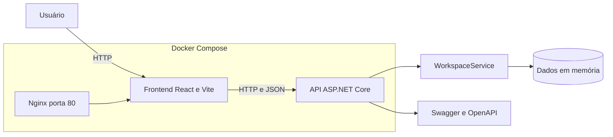

  

# Arquitetura do OrbitBoard

## Visão geral

O OrbitBoard usa uma arquitetura web em duas camadas executáveis. O frontend React roda no navegador e consome uma API REST ASP.NET Core por HTTP e JSON. Os dados ficam em memória no processo do backend e são recriados sempre que a API reinicia.

## Responsabilidades

| Componente | Responsabilidade | Execução local | Execução com Docker |
|---|---|---|---|
| Frontend | Interface, formulários, filtros, estados de carregamento e mensagens de erro | Vite na porta `5173` | Nginx na porta interna `80`, publicada como `5173` |
| Backend | Endpoints REST, validações, regras de negócio, CORS e tratamento de erros | ASP.NET Core na porta `5200` | ASP.NET Core na porta interna `8080`, publicada como `5200` |
| Dados | Projetos, tarefas e integrantes usados pela aplicação | Memória do processo | Memória do container do backend |
| Infraestrutura | Build, rede, portas, variáveis e health checks | Processos separados | Docker Compose |

## Fluxo de uma operação

1. O usuário preenche um formulário no frontend.
2. O cliente em `frontend/src/api/client.js` serializa os dados em JSON.
3. A requisição é enviada para a URL definida em `VITE_API_URL`.
4. Um controller recebe a requisição e o ASP.NET Core valida o contrato.
5. O `WorkspaceService` aplica a regra de negócio e altera os dados em memória.
6. A API devolve JSON ou um erro no formato `ProblemDetails`.
7. O frontend atualiza a tela ou mostra uma mensagem de erro.

## Comunicação e CORS

No uso padrão, o navegador abre o frontend em `http://localhost:5173` e chama a API em `http://localhost:5200`. Como são origens diferentes, a API libera explicitamente a origem configurada em `Cors:AllowedOrigins`.

No Docker Compose, a variável `CORS_ALLOWED_ORIGIN` alimenta `Cors__AllowedOrigins__0`. A variável `VITE_API_URL` é aplicada durante o build do frontend e define o endereço público que o navegador usará.

## Rede e health checks

O Compose cria uma rede privada para os serviços. O frontend só inicia depois que o backend responde em `/health`. Cada serviço possui um health check próprio:

| Serviço | Verificação |
|---|---|
| Backend | `GET http://localhost:8080/health` dentro do container |
| Frontend | `GET http://localhost/health` dentro do container |

## Decisões técnicas

| Decisão | Justificativa |
|---|---|
| React com Vite | Mantém a interface simples, rápida para desenvolvimento e separada da API |
| ASP.NET Core 8 | Fornece controllers, validação, injeção de dependência, Swagger e middleware |
| Dados em memória | Reduz a configuração e mantém o foco didático na integração full stack |
| Nginx para produção do frontend | Serve o build estático e mantém suporte às rotas da aplicação React |
| Dockerfiles em múltiplos estágios | Separa compilação e execução, reduzindo as imagens finais |
| CORS configurável | Evita endereço fixo no código e permite ajustar a origem por ambiente |

## Limitações conhecidas

- Os dados não persistem após reiniciar a API.
- Não existe autenticação ou autorização.
- O frontend recebe a URL da API durante o build.
- O estado em memória não foi projetado para múltiplas instâncias do backend.
