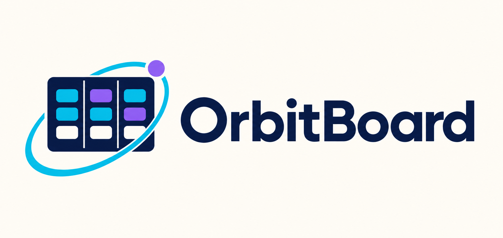

<p align="center">
  
</p>

# OrbitBoard | Frontend

Aplicação web em **React 18 + Vite** para consumir a API OrbitBoard e demonstrar integração full stack.

## Funcionalidades

- Dashboard com métricas e distribuição de tarefas.
- Tela de projetos com cadastro, edição, progresso e exclusão.
- Quadro de tarefas com filtros, criação, edição, exclusão e mudança de status.
- Modal de histórico de status de uma tarefa, acessível pelo quadro ou pela tabela.
- Tela de equipe.
- Estados de carregamento, vazio, sucesso e erro.
- Tratamento das respostas `400`, `404`, `409` e `500` retornadas pela API.
- URL da API configurável por variável de ambiente.
- Layout responsivo.

## Requisitos

- Node.js 20.19 ou superior.
- npm 10 ou superior.
- Backend OrbitBoard executando em `http://localhost:5200`.

Verifique:

```bash
node --version
npm --version
```

## Instalação

A partir da pasta `frontend`:

```bash
npm install
```

## Configuração

Copie o arquivo `.env.example` para `.env`:

```text
VITE_API_URL=http://localhost:5200
```

Caso o backend esteja em outro endereço, altere o valor.

## Executar em desenvolvimento

```bash
npm run dev
```

Acesse:

```text
http://localhost:5173
```

## Gerar build de produção

```bash
npm run build
```

Para visualizar o build localmente:

```bash
npm run preview
```

## Testes automatizados

```bash
npm test
```

Os testes usam **Vitest** e **Testing Library** e cobrem o cliente HTTP (`src/api/client.js`) e os componentes de tarefas, incluindo o modal de histórico de status (`TaskHistoryModal`), o menu de ações da tabela e a integração com `TasksPage`.

## Como executar com Docker

A partir da raiz do repositório:

```bash
docker compose up --build frontend
```

O build usa `VITE_API_URL` para definir o endereço público da API. O Nginx publica o frontend na porta `5173` e disponibiliza seu health check em `/health`.

## Fluxos sugeridos para validação

1. Abrir o dashboard e conferir as métricas.
2. Criar um projeto válido.
3. Tentar criar outro projeto com o mesmo nome e observar o erro `409`.
4. Criar uma tarefa associada a um projeto.
5. Filtrar tarefas por status e prioridade.
6. Alterar o status de uma tarefa pelo quadro.
7. Editar e excluir uma tarefa.
8. Tentar excluir um projeto que ainda possui tarefas e observar o erro de conflito.
9. Parar o backend e observar o tratamento de falha no frontend.

## Estrutura

```text
src/
├── api/          Cliente HTTP
├── components/   Layout, formulários e componentes reutilizáveis
├── pages/        Dashboard, projetos, tarefas e equipe
├── utils/        Traduções e estilos de status
├── App.jsx       Rotas
├── main.jsx      Inicialização do React
└── styles.css    Estilos globais e responsivos
```

## Integração com o backend

O cliente HTTP está em:

```text
src/api/client.js
```

Ele concentra:

- URL base da API;
- serialização JSON;
- interpretação de respostas;
- transformação de erros `ProblemDetails` em mensagens para a interface.
